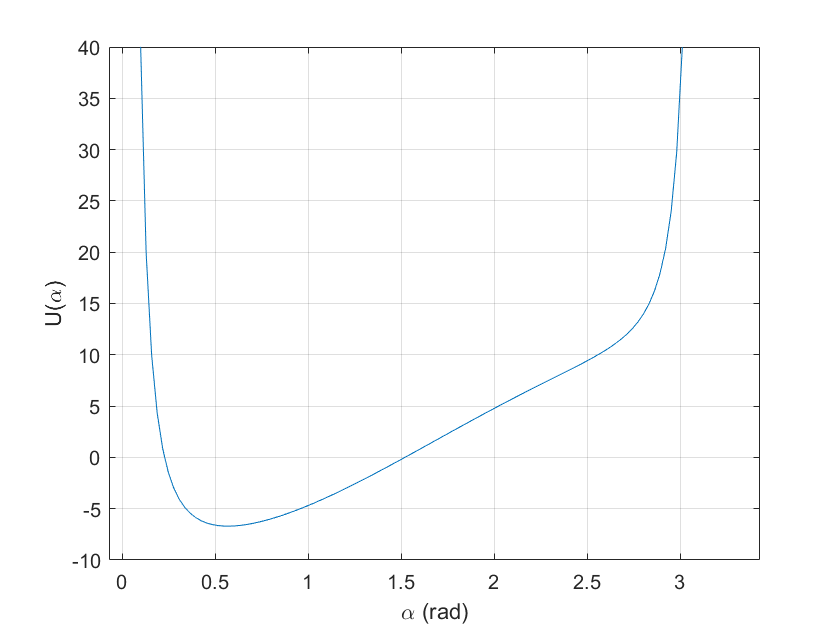

# spherical_pendulum
### About
MATLAB R2022a project for plotting an animated spherical pendulum given 
certain initial conditions.

### How to use
* Clone the repository.
* Open the folder from MATLAB's file explorer.
* Double click `Spherical_pendulum.prj` or open `main.m` and click `Run`.
* Answer the prompts in the `Command Window`, hitting enter after 
inputting each value.
* Wait while the animation loads, MATLAB should open a figure window.
N.B.: The animation might lag a bit, especially the first few seconds and 
maybe while rotating the figure.

### Preview

  

### Theory
Using generalised coordinates $\theta$ (polar angle) and $\varphi$ 
(azimuthal angle), one can compute the Lagrangian of a spherical pendulum
with a bob of mass $m$ and rod of length $l$ to be:

$$L=ml^2\left[\frac{1}{2}(\dot{\theta}^2+\dot{\varphi}^2\sin^{2}\theta)
-\frac{g}{l}\cos\theta\right]
\propto\frac{1}{2}(\dot{\theta}^2+\dot{\varphi}^2\sin^{2}\theta)
-\frac{g}{l}\cos\theta$$ 

Or in terms of the angle wrt the $-z$ direction, $\alpha=\pi-\theta$:

$$\tilde{L}=\frac{1}{2}(\dot{\alpha}^2+\dot{\varphi}^2\sin^{2}\alpha)
+\frac{g}{l}\cos\alpha$$ 

With canonical azimuthal momentum:

$$p_\varphi=\dot{\varphi}\sin^{2}\alpha=const.$$

The system is at equilibrium for $\alpha=0,\pi,\,\dot{\alpha}=0$, and acts 
as a simple pendulum if $p_\varphi=0$. For other trajectories the energy 
integral yields a more complicated equation of motion, similar to that of 
an effective particle in a 1D potential:

$$h=\frac{1}{2}\dot{\alpha}^2+U(\alpha)$$

$$U(\alpha)=\frac{{p_\varphi}^2}{2\sin^{2}\alpha}-\frac{g}{l}\cos\alpha$$

  

And thus the problem is reduced to quadratures:

$$t=\pm\frac{1}{\sqrt{2}}\int_{\alpha_0}\frac{d\alpha}{\sqrt{h-U(\alpha)}}$$

$$\varphi-\varphi_0=p_\varphi\int_0\frac{dt}{\sin^{2}\alpha}
$$

Note $h-U(\alpha)$, $\alpha\in(0, \pi)$ has either one (stable equilibrium) 
or two (turning points) real roots, therefore so should  
$(h-U(\alpha))\sin^2\alpha$. Let's perform the change of variables 
$\xi=\cos\alpha$:

$$
(h-U(\alpha))\sin^2\alpha\equiv p(\xi)=
-\frac{g}{l}\xi^3-h\xi^2+\frac{g}{l}\xi+h-\frac{{p_\varphi}^2}{2}
$$

Applying the change of variables $d\xi=-\sin\alpha\,d\alpha$, we obtain

$$
t=\mp\frac{1}{\sqrt{2}}\int_{\cos\alpha_0}\frac{d\xi}{\sqrt{p(\xi)}}
$$

If $\xi_1>\xi_2>\xi_3$ are the roots of $p(\xi)$, to solve the problem we 
must succesively integrate between the two roots $\in(-1,1)$. From 
Abrahamovitz and Stegun p. 597 table 17.4.61:

$$
\mp\lambda t\sqrt{2g/l} +\epsilon_0 = F(\phi| m_1)
$$

$$
\lambda=\frac{1}{2}\sqrt{\xi_1-\xi_3}, \quad
m_1=\frac{\xi_1- \xi_2}{\xi_1- \xi_3}, \quad
\sin^2\phi=\frac{(\xi_1-\xi_3)(\xi-\xi_2)}{(\xi_1-\xi_2)(\xi-\xi_3)}
$$

And we finally obtain:

$$
\cos\alpha=\frac{m_1\xi_3\sin^2\phi-\xi_2}{m_1\sin^2\phi-1}, \quad
\sin\phi=\mathrm{sn}(\mp\lambda t\sqrt{2g/l}+\epsilon_0|m_1)
$$

where $\epsilon_0$ makes it so that $\alpha(t=0)=\alpha_0$ and can be 
calculated setting $\alpha=\alpha_0$, $t=0$. We then numerically integrate
$\varphi(t)$.

This derivation is for illustrative purposes, be careful with signs and
different particular cases.